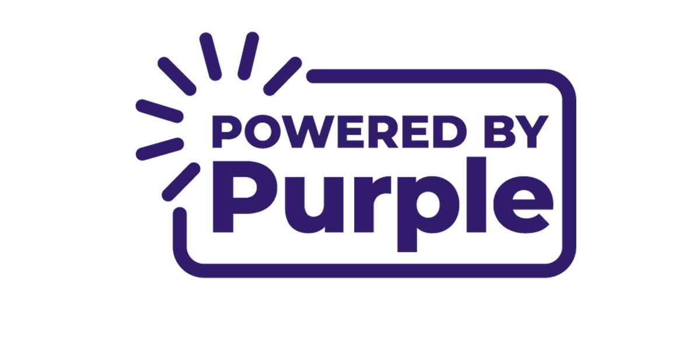

---

<p align="center">
  
</p>

# BrightSign Dev Cookbook

[](LICENSE)
[](https://github.com/brightsign/dev-cookbook/actions)

## Introduction

Welcome to the BrightSign Dev Cookbook! Here you will find example code and projects for your [BrightSign](https://www.brightsign.biz/) digital signage devices that demonstrate various capabilities.

Whether you're a beginner eager to dive into BrightSign development, or an advanced developer looking to expand your skills, this cookbook offers a wide range of examples to demonstrate the capabilities of these devices.

## Using this resource locally

To use this repository locally, use the `git clone` functionality. To do this, click the green `<> Code` button in the top right and copy the http or ssh url to your clipboard. Then in your terminal or command line, run the following:
```zsh
git clone https://github.com/brightsign/dev-cookbook.git
```

## Learning the basics with examples

If you've never worked with a BrightSign before, we recommend starting with a [barebones example](simple_html_example).

After this, we recommend integrating node into the application on the BrightSign player. An example of this can be found in [html_node_example](Link to simple html and node example).

Once this seems familiar, we recommend adding auxiliary tools to make the development experience smoother. This includes introducing a script to copy files to the player's sd card, defining multiple environments to develop locally rather than needing to only rely on the player for visibility, and therefore, a mock library for populating values when running the example locally. This can be found [here](robust_example)

From here, we recommend using one of the templates to start developing your own project!

## Hit the ground running with templates
The templates in this repository are intended for developers who are familiar with Node.js, React, and running scripts that connect to devices over a local network.

## Installation

## Project structure

Here's an overview of the project structure and what each part is responsible for:

`templates`         : React templates for new projects with custom configurations tailored for BrightSign development.

`examples`          : A collection of examples demonstrating different capabilities and how to implement them on your BrightSign device.

`.github/`          : Contains GitHub Actions configurations for automated build and deployment processes.

`scripts/`          : Utility scripts to facilitate build, deployment, and development workflows.

`.eslintrc`         : Lint configuration to ensure code quality and consistency across the project.

`package.json`      : Manages project dependencies and scripts for an efficient development workflow.

### Getting Started

This monorepo uses [yarn workspaces](https://classic.yarnpkg.com/lang/en/docs/workspaces/) to manage dependencies and run commands. Simply run `yarn install` from the workspace root and explore the examples!

To run the tests for every example, run `yarn workspaces run test` or the shortcut `yarn test`.

## Feedback/Contributing

We welcome contributions to the BrightSign Dev Cookbook! Please see our [Contributing Guidelines](CONTRIBUTING.md) for more information.

Feel free to open an issue or submit a PR; see `CONTRIBUTING.MD` for further information.

## Building on M1 Mac

You might see an error like `npm ERR! Error: Cannot find module 'node-bin-darwin-arm64/package.json'`

Run the following commands:

```bash
> node -v
v14.17.6
> node -p process.arch
arm64
> arch -x86_64 zsh
> nvm uninstall 14.17.6 && nvm install 14.17.6
```

You might need to do this each time you restart your terminal.

For more details, see this [Stack Overflow thread](https://stackoverflow.com/questions/68896696/having-trouble-installing-npm-on-mac-m1).

## Support

If you have any questions or need help, please open an issue on this repository or contact BrightSign support.

## License

This project is licensed under the MIT License. See the [LICENSE](LICENSE) file for details.

---