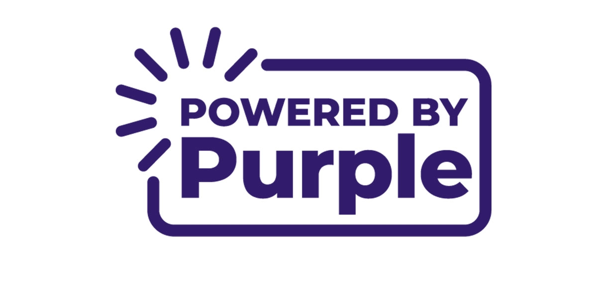

---

<p align="center">
  
</p>

# BrightSign Dev Cookbook

[](LICENSE)
[](https://github.com/brightsign/dev-cookbook/actions)

## Introduction

Welcome to the BrightSign Dev Cookbook! Here you will find example code and projects for your [BrightSign](https://www.brightsign.biz/) digital signage devices that demonstrate various capabilities.

Whether you're a beginner eager to dive into BrightSign development, or an advanced developer looking to expand your skills, this cookbook offers a wide range of examples to demonstrate the capabilities of these devices.

## Table of Contents

- [Installation](#installation)
- [Using this resource locally](#using-this-resource-locally)
- [Examples](#examples)
  - [Learning the basics with examples](#learning-the-basics-with-examples)
- [Templates](#templates)
  - [Hit the ground running with templates](#hit-the-ground-running-with-templates)
- [Project structure](#project-structure)
- [Contributing](#contributing)
- [Building on M1 Mac](#building-on-m1-mac)
- [Support](#support)
- [License](#license)

## Installation

To use the examples and templates in this repository, you'll need to clone the repository and navigate to the relevant directory.

```bash
git clone https://github.com/brightsign/dev-cookbook.git
cd dev-cookbook
```

## Using this resource locally

To use this repository locally, use the `git clone` functionality. To do this, click the green `<> Code` button in the top right and copy the HTTP or SSH URL to your clipboard. Then, in your terminal or command line, run the following:

```bash
git clone https://github.com/brightsign/dev-cookbook.git
```

## Examples

### Overview

The examples in this repository are designed to help you get started with developing on a BrightSign player. These examples serve as stepping stones, allowing you to build and expand your understanding of the platform.

### Learning the basics with examples

If you've never worked with a BrightSign before, we recommend starting with the [HTML starter example](examples/browser/html-starter/README.md).

After this, we recommend integrating Node.js into the application on the BrightSign player. An example of this can be found in [node-simple-server](examples/node-14/node-simple-server/README.md).

Once this seems familiar, explore more advanced examples like the [self-updater](examples/node-18/bs-self-updater/README.md) or [provisioning server](examples/node-18/provisioning-server/README.md) to learn about deployment and fleet management.

From here, we recommend using one of the templates to start developing your own project!

## Templates

### Overview

The templates in this repository are starter projects that you can use to begin development on top of existing setups. These templates are designed to provide a solid foundation, allowing you to hit the ground running with your BrightSign projects.

### Hit the ground running with templates

The templates in this repository are intended for developers who are familiar with Node.js, React, and running scripts that connect to devices over a local network.

We recommend managing your Node.js version using [nvm](https://github.com/nvm-sh/nvm/blob/master/README.md). BrightSign devices ship with different Node.js versions depending on the OS:

- **BrightSign OS 8.x**: Node.js `14.17.6`
- **BrightSign OS 9.x**: Node.js `18`

Each Node.js example includes an `.nvmrc` file. Run `nvm use` in the example directory to automatically switch to the correct version. See the [examples README](examples/README.md) for a full compatibility matrix.

## Project structure

Here's an overview of the project structure and what each part is responsible for:

- `templates/`         : React templates for new projects with custom configurations tailored for BrightSign development.
- `examples/`          : A collection of examples organized by runtime: `browser/` (HTML/BrightScript), `node-14/` (OS 8.x), and `node-18/` (OS 9.x).
- `.github/`          : Contains GitHub Actions configurations for automated build and deployment processes.
- `scripts/`          : Utility scripts to facilitate build, deployment, and development workflows.
- `.eslintrc`         : Lint configuration to ensure code quality and consistency across the project.
- `package.json`      : Manages project dependencies and scripts for an efficient development workflow.

### Getting Started

This monorepo uses [yarn workspaces](https://classic.yarnpkg.com/lang/en/docs/workspaces/) to manage dependencies and run commands. Simply run `yarn install` from the workspace root and explore the examples!

To run the tests for every example, run `yarn workspaces run test` or the shortcut `yarn test`.

## Feedback/Contributing

We welcome contributions to the BrightSign Dev Cookbook! Please see our [Contributing Guidelines](CONTRIBUTING.md) for more information.

Feel free to open an issue or submit a PR; see `CONTRIBUTING.MD` for further information.

## Building on M1 Mac

When using Node 14.17.6 on Apple Silicon, you might see an error like `npm ERR! Error: Cannot find module 'node-bin-darwin-arm64/package.json'`

Run the following commands:

```bash
> node -v
v14.17.6
> node -p process.arch
arm64
> arch -x86_64 zsh
> nvm uninstall 14.17.6 && nvm install 14.17.6
```

You might need to do this each time you restart your terminal. This issue does not affect Node 18+.

For more details, see this [Stack Overflow thread](https://stackoverflow.com/questions/68896696/having-trouble-installing-npm-on-mac-m1).

## Support

If you have any questions or need help, please open an issue on this repository or contact BrightSign support.

## License

This project is licensed under the MIT License. See the [LICENSE](LICENSE) file for details.

---