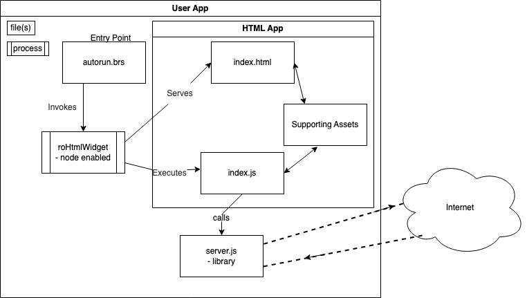
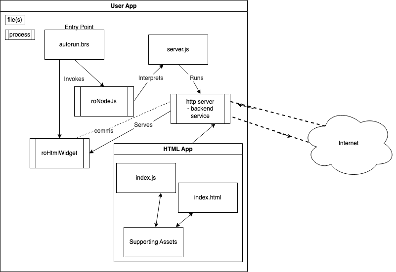

# Using Node.js with your project

As you work with the sample code in this repo, you will find references to `@brightsign` JavaScript modules. These modules provide BrightSign specific functionality and are built in to the device firmware. These modules can be integrated with your code to provide rich experiences on the device.

There are two main ways to run Node.js on your Brightsign device.

# roHtmlWidget

Create an [roHtmlWidget](https://brightsign.atlassian.net/wiki/spaces/DOC/pages/370672896/roHtmlWidget) object using BrightScript in your `autorun.brs` with the `nodejs_enabled` flag set to `true`. This creates a Chromium HTML renderer instance that can access the BrightSign JS modules. Set the URL of the widget to be an externally hosted page or to a file on your local filesystem. You can then set the size and position of the widget to be displayed on your device. This essentially creates a floating browser window that displays content of your choice.

```
aa=createobject("roassociativearray")
aa.url="http://test-server/index.html"
aa.nodejs_enabled=true

r=createobject("rorectangle",0,0,1920,1080)
h=createobject("rohtmlwidget",r,aa)
h.show()
```

Keep in mind that any JavaScript code in your `roHtmlWidget` will only be run as long as the widget is active. You can create and display multiple instances at once.

If you created a widget and it is not visible, the following could be happening:

1. `show()` is `false`
2. `roRectangle` has x and y values which are off the screen,
3. Your `index.html` doesn't render anything and contains a "visual passthrough"
4. Your content is at 100% opacity.




# roNodeJs

Launch a Node.js process in the background in BrightScript using [roNodeJs]( https://brightsign.atlassian.net/wiki/spaces/DOC/pages/404619466/roNodeJs). Supply any arguments you might need. Your code will need to be on your local filesystem.

```
node = CreateObject("roNodeJs", "index.js", {message_port:my_message_port, node_arguments: ["arg"], arguments: ["arg1", "arg2"]})
```

Unlike `roHtmlWidget`, an `roNodeJs` object will run in the background uninterrupted. You can use this for long running processes like gathering metrics or running a web server. You can even pass messages between this process and code running in an `roHtmlWidget` using an `roNodeJsEvent`. The message would be received in by the OS layer's `roMessagePort` as an `roNodeJsEvent`. To send it to an `roHtmlWidget` you must execute `roMessagePort.SendJsMessage()` in your widget.

The `cra-template-` examples use an `roNodeJs` to host a static server (see `template/src/server/index.js`) which serves the frontend HTML and other files. In `autorun.brs` you can see how the config is actually pointed at the Node.js process running the server, not an HTML file.

You can also inspect the running process by setting `"--inspect=0.0.0.0:2999"` in `node_arguments`. In Chrome, open DevTools at `chrome://inspect` and configure your network targets.

```
  config = {
    nodejs_enabled: true
    inspector_server: {
      port: 3000
    }
    url: "http://localhost:8020"
    port: mp
  }
```




# Conclusion

Use `roNodeJs` if you need a long running background process or have more complex needs. Use `roHtmlWidget` with Node.js enabled for browser-based apps. Both have access to BrightSign [JavaScript APIs](https://brightsign.atlassian.net/wiki/spaces/DOC/pages/370678188/JavaScript+APIs). 

### References / Further Reading

roNodeJs: https://brightsign.atlassian.net/wiki/spaces/DOC/pages/404619466/roNodeJs
roHtmlWidget: https://brightsign.atlassian.net/wiki/spaces/DOC/pages/370672896/roHtmlWidget
JavaScript APIs: https://brightsign.atlassian.net/wiki/spaces/DOC/pages/370678188/JavaScript+APIs 
roNodeJsEvent: https://brightsign.atlassian.net/wiki/spaces/DOC/pages/404621871/roNodeJsEvent

