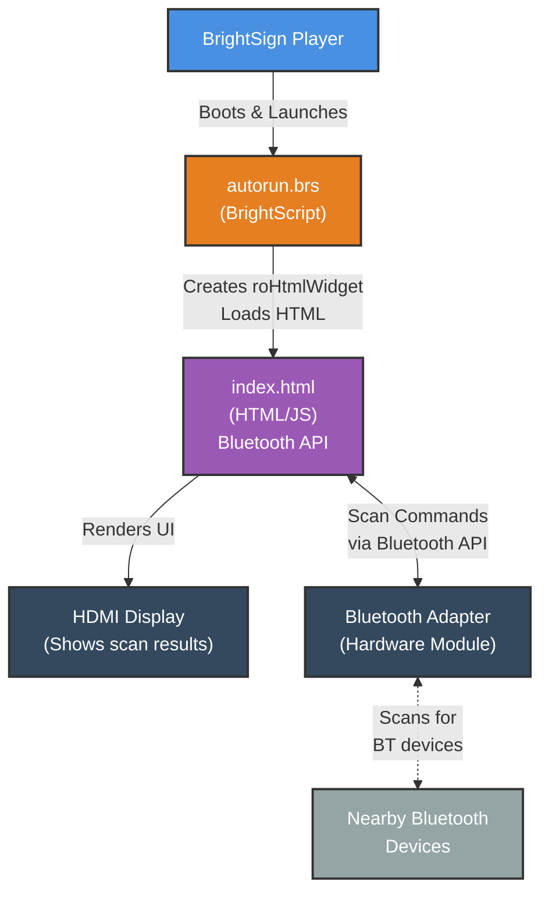

# Architecture Diagram

```mermaid
graph TD
    Player["BrightSign Player"]
    Autorun["autorun.brs<br/>(BrightScript)"]
    HTML["index.html<br/>(HTML/JS)<br/>Bluetooth API"]
    Display["HDMI Display<br/>(Shows scan results)"]
    BTAdapter["Bluetooth Adapter<br/>(Hardware Module)"]
    BTDevices["Nearby Bluetooth<br/>Devices"]

    Player -->|"Boots & Launches"| Autorun
    Autorun -->|"Creates roHtmlWidget<br/>Loads HTML"| HTML
    HTML -->|"Renders UI"| Display
    HTML <-->|"Scan Commands<br/>via Bluetooth API"| BTAdapter
    BTAdapter <-.->|"Scans for<br/>BT devices"| BTDevices

    style Player fill:#4a90e2,stroke:#333,stroke-width:2px,color:#fff
    style Autorun fill:#e67e22,stroke:#333,stroke-width:2px,color:#fff
    style HTML fill:#9b59b6,stroke:#333,stroke-width:2px,color:#fff
    style Display fill:#34495e,stroke:#333,stroke-width:2px,color:#fff
    style BTAdapter fill:#34495e,stroke:#333,stroke-width:2px,color:#fff
    style BTDevices fill:#95a5a6,stroke:#333,stroke-width:2px,color:#fff
```

## Legend
- **Blue**: BrightSign Player
- **Orange**: BrightScript
- **Purple**: HTML/JS Application
- **Dark Gray**: External Hardware
- **Gray**: External Devices
