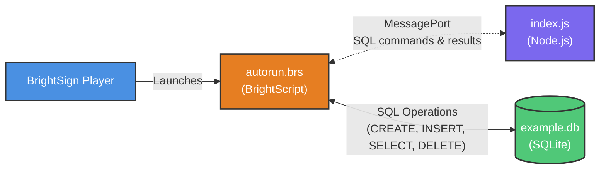

# Architecture Diagram

## Legend
- **Blue**: BrightSign Player
- **Orange**: BrightScript
- **Purple**: Node.js Application
- **Green**: Database/Storage
- **Solid Arrow**: Launches/Executes
- **Dashed Arrow**: MessagePort/IPC
- **Bidirectional Arrow**: SQL Operations
