# Architecture Diagram

## CEC Interface: Two Implementation Methods

```mermaid
graph TD
    subgraph Method1["Method 1: BrightScript - roCecInterface"]
        M1Player["BrightSign Player"]
        M1Autorun["autorun.brs"]
        M1HTML["index.html<br/>roCecInterface API"]
        M1CEC["CEC Commands<br/>(Image View On, Standby)"]
        M1Display["HDMI Display<br/>(CEC-enabled)"]

        M1Player -->|Launches| M1Autorun
        M1Autorun -->|Loads HTML| M1HTML
        M1HTML -->|Sends CEC| M1CEC
        M1CEC -->|HDMI-CEC| M1Display
    end

    subgraph Method2["Method 2: JavaScript - @brightsign/cec"]
        M2Player["BrightSign Player"]
        M2Autorun["autorun.brs"]
        M2HTML["index.html"]
        M2NodeJS["index.js<br/>@brightsign/cec"]
        M2CEC["CEC Commands<br/>(Image View On, Standby)"]
        M2Display["HDMI Display<br/>(CEC-enabled)"]

        M2Player -->|Launches| M2Autorun
        M2Autorun -->|Loads| M2HTML
        M2Autorun -->|Starts Node.js| M2NodeJS
        M2NodeJS -->|Sends CEC| M2CEC
        M2CEC -->|HDMI-CEC| M2Display
    end

    style M1Player fill:#4a90e2,stroke:#333,stroke-width:2px,color:#fff
    style M1Autorun fill:#e67e22,stroke:#333,stroke-width:2px,color:#fff
    style M1HTML fill:#9b59b6,stroke:#333,stroke-width:2px,color:#fff
    style M1CEC fill:#f39c12,stroke:#333,stroke-width:2px,color:#fff
    style M1Display fill:#34495e,stroke:#333,stroke-width:2px,color:#fff

    style M2Player fill:#4a90e2,stroke:#333,stroke-width:2px,color:#fff
    style M2Autorun fill:#e67e22,stroke:#333,stroke-width:2px,color:#fff
    style M2HTML fill:#9b59b6,stroke:#333,stroke-width:2px,color:#fff
    style M2NodeJS fill:#7b68ee,stroke:#333,stroke-width:2px,color:#fff
    style M2CEC fill:#f39c12,stroke:#333,stroke-width:2px,color:#fff
    style M2Display fill:#34495e,stroke:#333,stroke-width:2px,color:#fff
```

## Legend
- **Blue**: BrightSign Player
- **Orange**: BrightScript
- **Purple**: HTML/JS Application
- **Medium Purple**: Node.js Application
- **Yellow-Orange**: CEC Commands
- **Dark Gray**: External Hardware
