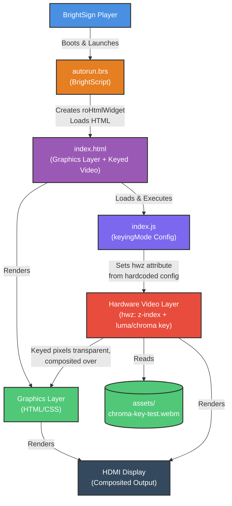

# Architecture Diagram

## Keying Flow

1. **HTML load**: `index.html` renders the graphics layer (a striped background standing in for real HTML/CSS content) and a bare `<video>` element with no `src`/`hwz` attribute yet.
2. **Config-driven setup**: `index.js` builds the `hwz` string from the hardcoded constants at the top of the file — `luma-key` alone if `keyingMode` is `'luma'`, or `cb-key` + `cr-key` plus the required companion `luma-key` workaround value if `'chroma'` — sets it and `src` on the `<video>` element, and starts playback. No keyboard/mouse input is needed or expected on the player. The applied `hwz` string is also rendered on-screen and logged to the console.
3. **Video plays**: the player's hardware decode pipeline plays the video on its own layer, positioned relative to the graphics layer per `z-index`.
4. **Keying**: every pixel matching the configured luma or chroma range(s) becomes fully transparent; all other pixels stay fully opaque (hard-edged, not blended). Chroma-keying is what allows dark/black foreground content to survive when the background is a saturated, foreground-exclusive color — but requires the companion `luma-key` workaround value to activate at all on current BrightSign OS builds.
5. **Compositing**: the display shows the graphics layer showing through the keyed-out regions of the video, with opaque video pixels on top (or behind, if `z-index` is negative).

## Key Concepts

- **Two independent layers**: BrightSign composites a hardware video layer and an HTML graphics layer; `hwz` controls their stacking order and how transparency between them behaves.
- **Hard-edged keying**: transparency is a binary in/out-of-range test per pixel, not alpha blending — clean source video is essential.
- **Chroma-keying needs a companion value**: `cb-key`/`cr-key` silently do nothing without an accompanying `luma-key` parameter present in the same `hwz` string — a confirmed BrightSign OS quirk, not a code bug in this example.
- **Attribute, not live property**: `hwz` is read at video pipeline initialization, so runtime changes need a `video.load()` to apply.
- **Hardware-only effect**: desktop browsers ignore `hwz` entirely; you must test on an actual BrightSign player to see the transparency.

## Legend

- **Blue**: BrightSign Player
- **Orange**: BrightScript
- **Purple**: HTML/JS Application
- **Purple (Dark)**: JavaScript Logic
- **Red**: Hardware Video Layer
- **Green**: Graphics Layer / Assets
- **Dark Gray**: External Hardware
