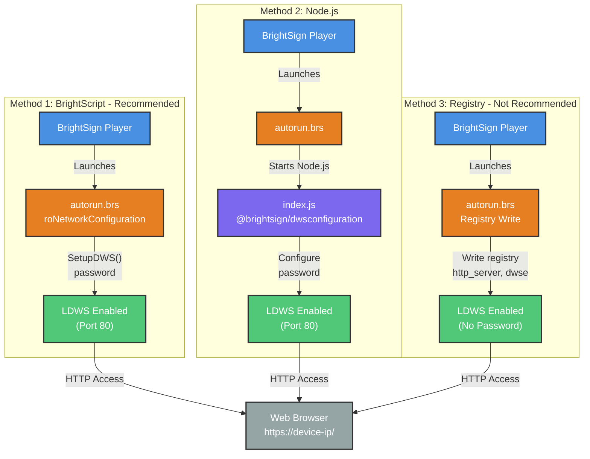

# Architecture Diagram

## Three Methods to Enable LDWS

## Legend
- **Blue**: BrightSign Player
- **Orange**: BrightScript
- **Purple**: Node.js Application
- **Green**: Service/LDWS
- **Gray**: Web Browser

## Result
All three methods enable LDWS, allowing access via web browser to https://device-ip/
