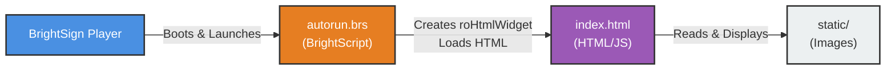

# Architecture Diagram

```mermaid
graph LR
    Player["BrightSign Player"]
    Autorun["autorun.brs<br/>(BrightScript)"]
    HTML["index.html<br/>(HTML/JS)"]
    Static["static/<br/>(Images)"]

    Player -->|"Boots & Launches"| Autorun
    Autorun -->|"Creates roHtmlWidget<br/>Loads HTML"| HTML
    HTML -->|"Reads & Displays"| Static

    style Player fill:#4a90e2,stroke:#333,stroke-width:2px,color:#fff
    style Autorun fill:#e67e22,stroke:#333,stroke-width:2px,color:#fff
    style HTML fill:#9b59b6,stroke:#333,stroke-width:2px,color:#fff
    style Static fill:#ecf0f1,stroke:#333,stroke-width:2px,color:#333
```

## Legend
- **Blue**: BrightSign Player
- **Orange**: BrightScript
- **Purple**: HTML/JS Application
- **Light Gray**: File/Content
