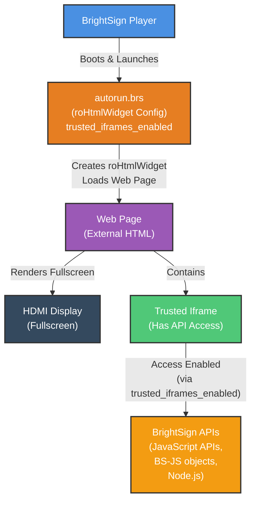

# Architecture Diagram

## Default Behavior (BOS v9.1+)
- Iframes have NO API access
- Enhanced security by default

## roHtmlWidget Configuration
- `trusted_iframes_enabled: true`
- Enables JavaScript APIs in iframes
- Enables BS-JS objects in iframes
- Enables Node.js in iframes

## Security Warning
⚠️ **NOT RECOMMENDED for production**: Iframes gain access to core player APIs. Only use for trusted, controlled content.

Available in BOS v9.1.75.3+

## Legend
- **Blue**: BrightSign Player
- **Orange**: BrightScript
- **Purple**: Web Page
- **Green**: Trusted Iframe
- **Yellow-Orange**: BrightSign APIs
- **Dark Gray**: External Hardware
