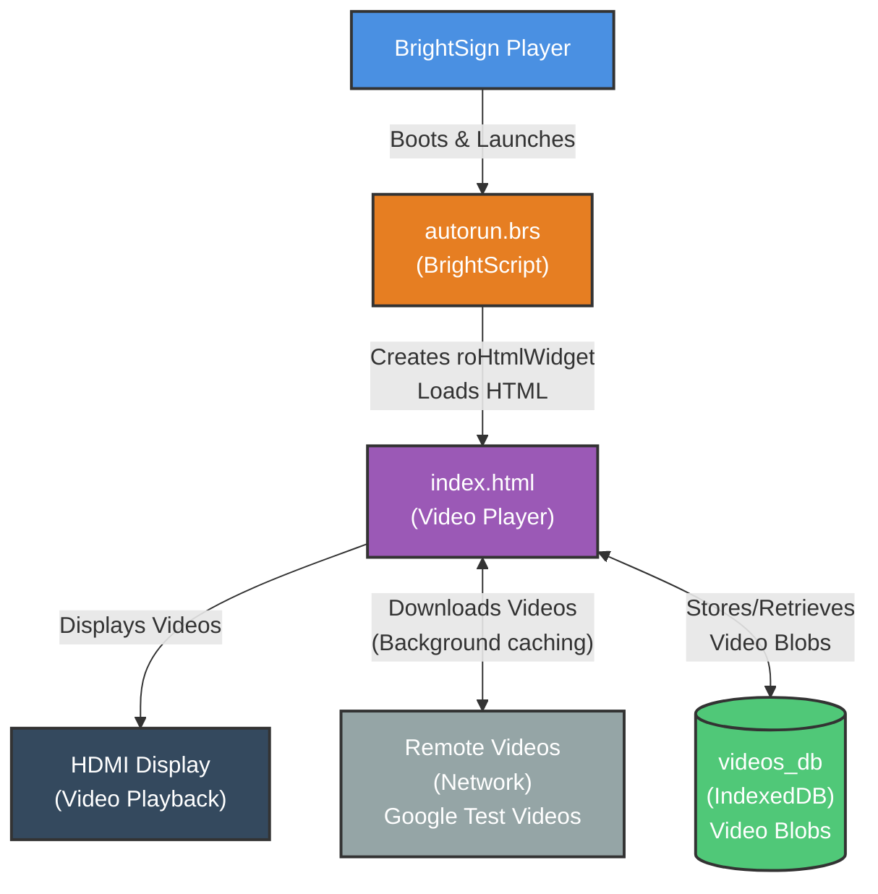

# Architecture Diagram

## Caching Strategy
1. Create IndexedDB (videos_db/videos_os)
2. Check cache for existing videos
3. Play first video (cached or download)
4. Background download remaining videos
5. Store video blobs in IndexedDB
6. Subsequent playback from cache
7. Auto-advance & loop playlist

## Storage
- IndexedDB for large storage capacity
- Videos stored as blobs
- Uses available disk space
- Better than localStorage (5MB limit)

## Legend
- **Blue**: BrightSign Player
- **Orange**: BrightScript
- **Purple**: HTML/JS Application
- **Dark Gray**: External Hardware
- **Green**: IndexedDB Storage
- **Gray**: Network/Remote
