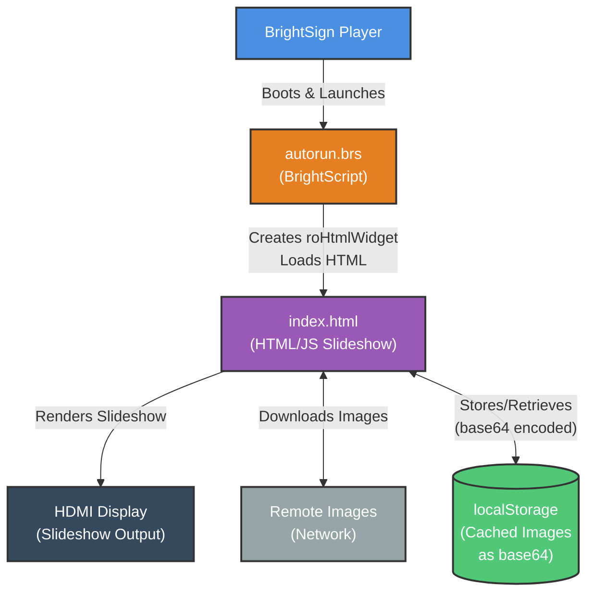

# Architecture Diagram

## Flow
1. Check localStorage for cached images
2. Download missing images from network
3. Convert to base64 & cache in localStorage
4. Display slideshow from cached images
5. Loop continuously

## Legend
- **Blue**: BrightSign Player
- **Orange**: BrightScript
- **Purple**: HTML/JS Application
- **Dark Gray**: External Hardware
- **Green**: Browser Storage
- **Gray**: Network/Remote
