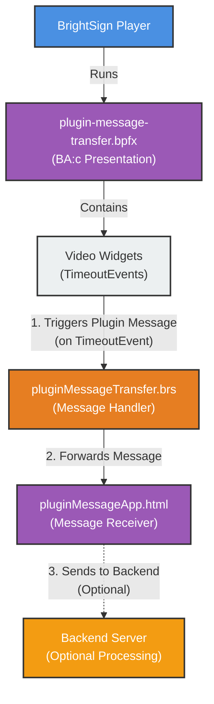

# Architecture Diagram



## Plugin Message Format
```
pluginMessage!!<serialNumber>!!<filename>
```

## Example Flow
1. Video plays in widget
2. TimeoutEvent fires
3. Plugin message sent: `pluginMessage!!D5E86P001287!!1stVideo`
4. BrightScript receives & forwards
5. HTML app processes message
6. Optional: Forward to backend API

## Legend
- **Blue**: BrightSign Player
- **Orange**: BrightScript
- **Purple**: Presentation/HTML
- **Yellow-Orange**: External Server
- **Light Gray**: Widget/Content
