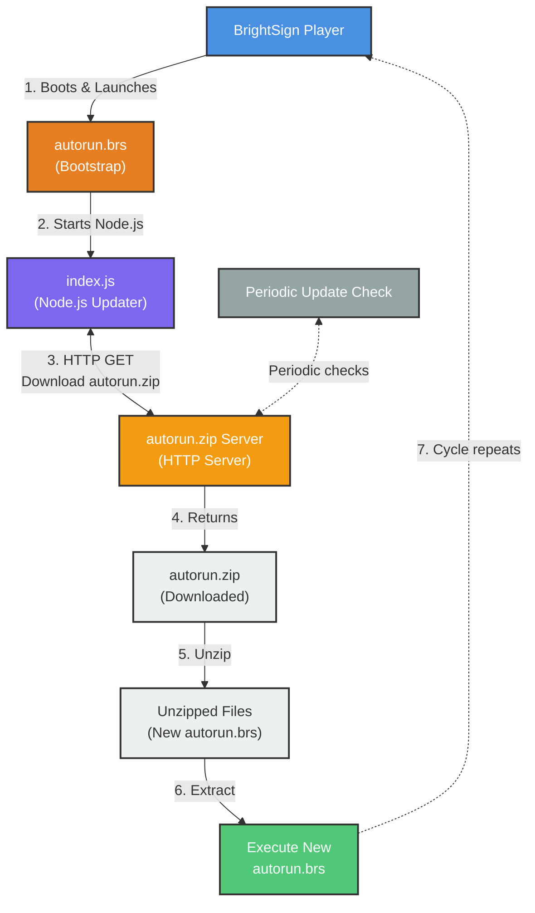

# Architecture Diagram

## Update Flow

1. Player boots and runs bootstrap autorun.brs
2. Bootstrap launches Node.js updater script
3. Updater downloads autorun.zip from SERVER_URL
4. Unzips package to extract new autorun.brs
5. Executes new autorun, replacing bootstrap
6. Process repeats with periodic checks (15 min)

## Configuration (index.ts)

-   `SERVER_URL`: Server endpoint
-   `CHECK_INTERVAL_MS`: 15 minutes
-   `STORAGE_PATH`: /storage/sd
-   Enables remote app updates

## Deployment Files

-   `/storage/sd/autorun.brs` (bootstrap)
-   `/storage/sd/index.js` (updater)

## Legend

-   **Blue**: BrightSign Player
-   **Orange**: BrightScript
-   **Purple**: Node.js Application
-   **Yellow-Orange**: External Server
-   **Light Gray**: File/Content
-   **Green**: Process/Action
-   **Gray**: Periodic Check
