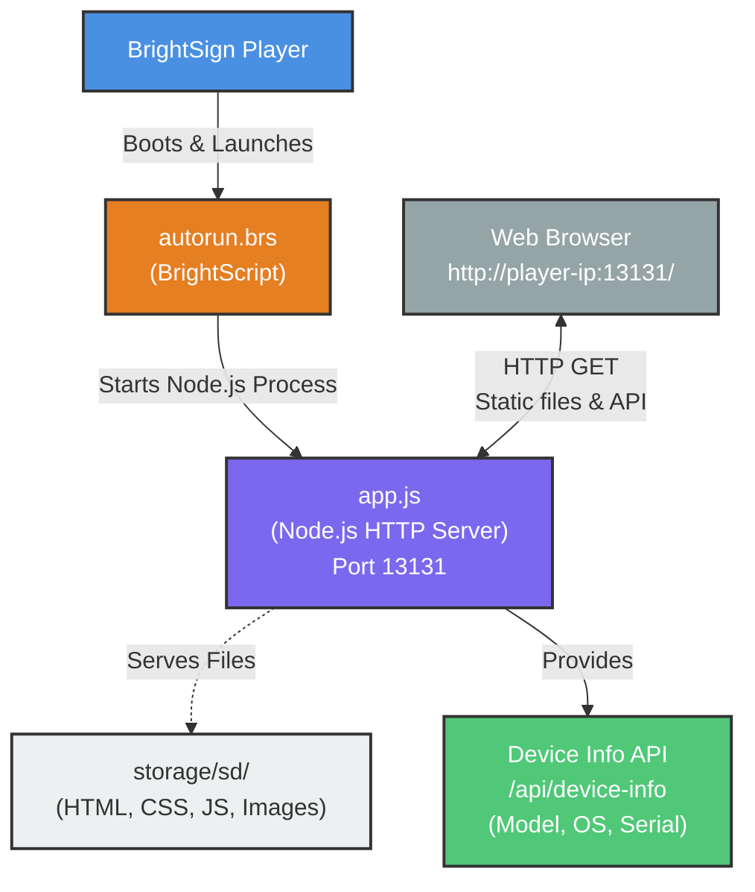

# Architecture Diagram

## Endpoints

-   `/` → index.html
-   `/api/device-info` → JSON

## Legend

-   **Blue**: BrightSign Player
-   **Orange**: BrightScript
-   **Purple**: Node.js Application
-   **Green**: API Endpoint
-   **Light Gray**: File/Content
-   **Gray**: Network/Browser
