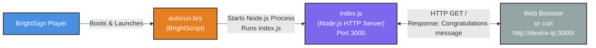

# Architecture Diagram

```mermaid
graph LR
    Player["BrightSign Player"]
    Autorun["autorun.brs<br/>(BrightScript)"]
    NodeJS["index.js<br/>(Node.js HTTP Server)<br/>Port 3000"]
    Browser["Web Browser<br/>or curl<br/>http://device-ip:3000/"]

    Player -->|"Boots & Launches"| Autorun
    Autorun -->|"Starts Node.js Process<br/>Runs index.js"| NodeJS
    NodeJS <-->|"HTTP GET /<br/>Response: Congratulations message"| Browser

    style Player fill:#4a90e2,stroke:#333,stroke-width:2px,color:#fff
    style Autorun fill:#e67e22,stroke:#333,stroke-width:2px,color:#fff
    style NodeJS fill:#7b68ee,stroke:#333,stroke-width:2px,color:#fff
    style Browser fill:#95a5a6,stroke:#333,stroke-width:2px,color:#fff
```

## Legend
- **Blue**: BrightSign Player
- **Orange**: BrightScript
- **Purple**: Node.js Application
- **Gray**: Network/Browser
