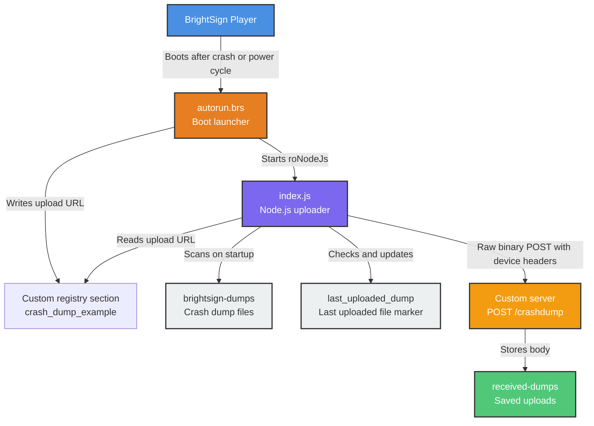

# Architecture Diagram

## Boot Upload Flow

1. Player boots and runs `autorun.brs`.
2. `autorun.brs` ensures `SD:/brightsign-dumps` exists and starts `index.js` with `roNodeJs`.
3. `autorun.brs` writes the upload URL to the custom registry section `[crash_dump_example] upload_url`.
4. `index.js` reads the upload URL with `@brightsign/registry`.
5. `index.js` detects the default storage path with `@brightsign/storage.priorityOrder` when available.
6. The app scans the configured dump folder, sorts dump files oldest-to-newest, and compares each current file to the last uploaded timestamp in registry.
7. Each new dump is posted to the configured `POST /crashdump` endpoint as a raw binary request body.
8. After each 2xx response, the app records the upload in `[crash_dump_example] last_uploaded_dump`.
9. If `DELETE_AFTER_UPLOAD` is enabled, the app deletes the local dump after state is written.

## Configuration

-   `REGISTRY_SECTION`: Custom registry section name, default `crash_dump_example`.
-   `UPLOAD_URL_REGISTRY_KEY`: Custom registry key name, default `upload_url`.
-   `LAST_UPLOADED_DUMP_REGISTRY_KEY`: Custom registry key used to prevent duplicate uploads, default `last_uploaded_dump`.
-   `DELETE_AFTER_UPLOAD`: Optional cleanup behavior after a successful upload.
-   `REQUEST_TIMEOUT_MS`: Per-request upload timeout.
