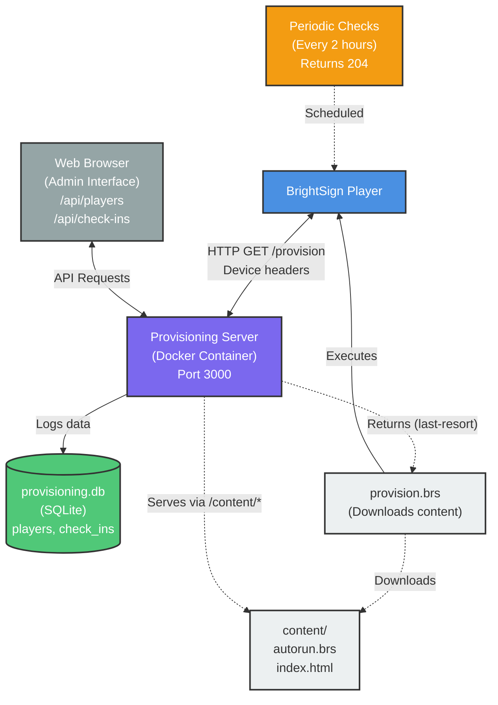

# Architecture Diagram

## Recovery Modes
- **last-resort**: No autorun (200 + provision.brs)
- **override**: Manual check
- **periodic**: Scheduled (204 or new autorun)

## Server Endpoints
- `/provision` - Provisioning endpoint
- `/content/*` - Static file server
- `/api/players` - List players (JSON)
- `/api/check-ins` - Check-in history
- `/health` - Health check

## Device Headers
DeviceId, DeviceModel, DeviceFamily, DeviceFwVersion, RecoveryMode, DeviceUpTime, StorageStatus

## Flow
1. Player boots, contacts server
2. Server logs check-in to database
3. Server returns provision.brs script
4. Script downloads content from server
5. Player installs and runs content
6. Player checks periodically for updates

## Legend
- **Blue**: BrightSign Player
- **Purple**: Provisioning Server
- **Green**: Database/Storage
- **Light Gray**: File/Content
- **Gray**: Network/Browser
- **Yellow-Orange**: Periodic Process
