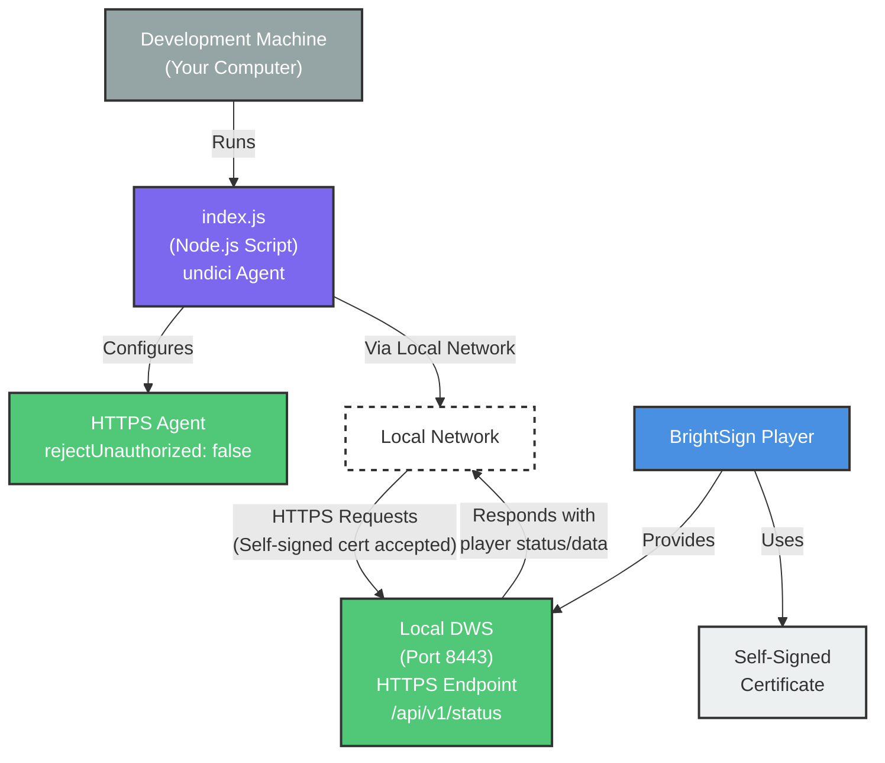

# Architecture Diagram



## Communication Flow
1. BrightSign player automatically generates self-signed certificate
2. DWS (Diagnostic Web Server) listens on port 8443 (HTTPS)
3. Node.js script configures undici Agent with `rejectUnauthorized: false` to accept self-signed certificates
4. Script makes HTTPS requests to DWS API endpoints (e.g., `/api/v1/status`)
5. DWS responds with player status/data in JSON format

## Security Note
⚠️ **Warning**: Only use `rejectUnauthorized: false` for trusted local player communication. Never use for external endpoints.

## Code Example
```javascript
const { Agent } = require('undici');

const httpsAgent = new Agent({
    connect: {
        rejectUnauthorized: false,
    },
});

const url = `https://${playerIP}:8443/api/v1/status`;
const response = await fetch(url, {
    dispatcher: httpsAgent
});
```

## Legend
- **Blue**: BrightSign Player
- **Purple**: Node.js Application
- **Green**: Service/API Configuration
- **Gray**: Development Machine
- **Light Gray**: File/Certificate
- **Dashed**: Network Connection
