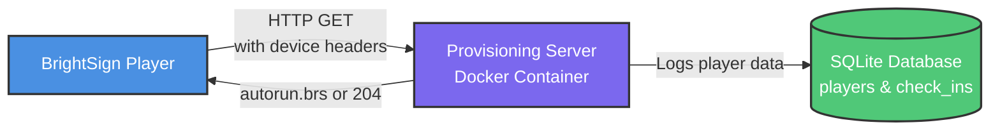

;# BrightSign Provisioning Server Example

A Docker-based provisioning server for BrightSign players on a local network. This server implements the BrightSign provisioning and recovery protocol, allowing players to automatically download and install content.

## Overview

This example demonstrates how to:

-   Run a provisioning server in a Docker container on your local network
-   Configure BrightSign players to use the provisioning server
-   Track player check-ins and manage deployments
-   Deliver the HTML starter example to players automatically

## Architecture



## Prerequisites

-   Docker and Docker Compose installed on your local machine
-   BrightSign player on the same network
-   Network access between player and your machine

## Quick Start

### 1. Build and Start the Server

```bash
cd examples/provisioning-server-example
docker-compose up -d
```

The server will start on port 3000.

### 2. Find Your Server IP Address

Find your machine's IP address on the local network:

**Windows:**

```bash
ipconfig
```

Look for "IPv4 Address" (e.g., `192.168.1.100`)

**macOS/Linux:**

```bash
ifconfig
# or
ip addr show
```

### 3. Configure Your BrightSign Player

You need to set the provisioning URL in the player's registry. There are two ways to do this:

#### Option A: Using BrightScript Console (Recommended for Testing)

1. Connect to your player [via SSH](https://docs.brightsign.biz/advanced/telnet-and-ssh) or serial console
2. Access the BrightScript console
3. Enter the following commands:

```brightscript
reg = CreateObject("roRegistry")
net = CreateObject("roRegistrySection", "networking")
net.Write("ub", "http://YOUR_SERVER_IP:3000")
net.Write("ru", "/provision")
net.Flush()
RebootSystem()
```

Replace `YOUR_SERVER_IP` with your server's IP address (e.g., `192.168.1.100`).

#### Option B: Using a Bootstrap Autorun Script

Create an `autorun.brs` file on an SD card with:

```brightscript
function main()
    print "=== BrightSign Provisioning Bootstrap ==="
    
    ' Configure provisioning server
    registry = CreateObject("roRegistry")
    networkingSection = CreateObject("roRegistrySection", "networking")

    ' Set your server IP and port
    networkingSection.Write("ub", "http://YOUR_SERVER_IP:3000")
    networkingSection.Write("ru", "/provision")
    networkingSection.Flush()

    print "Registry configured successfully"
    print "Deleting bootstrap script to trigger provisioning..."
    
    ' Delete this bootstrap script so player enters last-resort mode
    DeleteFile("SD:/autorun.brs")
    
    print "Rebooting..."
    sleep(2000)
    RebootSystem()
end function
```

Replace `YOUR_SERVER_IP` with your server's IP address (e.g., `192.168.1.100`).

1. Save this file to an SD card as `autorun.brs`
2. Insert the SD card into your player
3. Reboot the player
4. The script will configure the registry, delete itself, and reboot
5. On second boot, the player will enter last-resort mode and download content from the server

### 4. Verify Provisioning

Once configured and rebooted:

1. The player will contact your provisioning server
2. Check the server logs:

    ```bash
    docker-compose logs -f
    ```

3. View registered players:

    ```
    http://YOUR_SERVER_IP:3000/api/players
    ```

4. View check-in history:
    ```
    http://YOUR_SERVER_IP:3000/api/check-ins
    ```

## How It Works

### Player Boot Process

1. **Player boots** and checks for local autorun file
2. **If no autorun found** (last-resort mode):

    - Player sends GET request to provisioning server
    - Server responds with `provision.brs` script
    - Script downloads application content and reboots

3. **After provisioning** (override/periodic mode):
    - Player checks in every 2 hours (configurable via `Retry-After` header)
    - Server returns 204 (no update) or 200 with new autorun (update available)

### Server Endpoints

| Endpoint                   | Method | Description                                           |
| -------------------------- | ------ | ----------------------------------------------------- |
| `/provision`               | GET    | Main provisioning endpoint - receives player requests |
| `/content/*`               | GET    | Static file server for content delivery               |
| `/api/players`             | GET    | List all registered players (JSON)                    |
| `/api/check-ins`           | GET    | View check-in history (JSON)                          |
| `/api/check-ins/:deviceId` | GET    | View check-ins for specific player                    |
| `/health`                  | GET    | Health check endpoint                                 |

### Request Headers (Player → Server)

The player sends these headers with each provisioning request:

| Header            | Example                | Description                              |
| ----------------- | ---------------------- | ---------------------------------------- |
| `DeviceId`        | `D5E86P001287`         | Unique player serial number              |
| `DeviceModel`     | `XT1144`               | Player model                             |
| `DeviceFamily`    | `malibu`               | Player family                            |
| `DeviceFwVersion` | `8.2.42`               | Firmware version                         |
| `RecoveryMode`    | `last-resort`          | `override`, `periodic`, or `last-resort` |
| `DeviceUpTime`    | `240`                  | Seconds since boot                       |
| `StorageStatus`   | `sd=autorun;usb1=none` | Storage device status                    |
| `CrashDump`       | `yes`                  | Present if crash occurred                |

### Server Response

| Status | Body                | Meaning                                |
| ------ | ------------------- | -------------------------------------- |
| 200    | autorun.brs content | Player will use this as new autorun    |
| 204    | (empty)             | Player continues with existing autorun |
| 200    | (empty)             | Player continues with existing autorun |

**Optional Header:** `Retry-After: 7200` (seconds until next check-in)

## Configuration

### Environment Variables

Configure in `docker-compose.yml`:

```yaml
environment:
    - PORT=3000 # Server port
    - DB_PATH=/app/data/provisioning.db # SQLite database path
```

### Changing Content

To serve different content:

1. Place your files in the `content/` directory:

    - `content/autorun.brs` - Application autorun script
    - `content/index.html` - HTML content
    - `content/static/*` - Static assets

2. The provisioning script (`autorun/provision.brs`) will download these files

3. Restart the container:
    ```bash
    docker-compose restart
    ```

### Customizing Provisioning Logic

Edit `autorun/provision.brs` to:

-   Download additional files
-   Set registry keys
-   Perform custom setup tasks
-   Change download URLs

Edit `server.js` to:

-   Change response logic based on player attributes
-   Implement device-specific provisioning
-   Add authentication
-   Track custom metrics

## Database Schema

The SQLite database tracks two tables:

### `players` Table

```sql
CREATE TABLE players (
    device_id TEXT PRIMARY KEY,
    device_model TEXT,
    device_family TEXT,
    device_fw_version TEXT,
    first_seen DATETIME,
    last_seen DATETIME
);
```

### `check_ins` Table

```sql
CREATE TABLE check_ins (
    id INTEGER PRIMARY KEY,
    device_id TEXT,
    recovery_mode TEXT,
    device_uptime INTEGER,
    storage_status TEXT,
    crash_dump BOOLEAN,
    timestamp DATETIME
);
```

## Troubleshooting

### Player Not Contacting Server

1. **Check network connectivity:**

    ```bash
    # From player console
    ping YOUR_SERVER_IP
    ```

2. **Verify registry settings:**

    ```brightscript
    reg = CreateObject("roRegistry")
    net = CreateObject("roRegistrySection", "networking")
    print net.Read("ub")  ' Should show http://YOUR_IP:3000
    print net.Read("ru")  ' Should show /provision
    ```

3. **Check server logs:**

    ```bash
    docker-compose logs -f
    ```

4. **Verify server is accessible:**
    ```bash
    curl http://YOUR_SERVER_IP:3000/health
    ```

### Player Stuck in Boot Loop

-   Check server logs to see if provisioning script is being delivered
-   Verify content files exist in `content/` directory
-   Test provisioning script syntax on player directly

### Database Issues

Reset the database:

```bash
docker-compose down
rm -rf data/
docker-compose up -d
```

### Port Conflicts

If port 3000 is already in use, change it in `docker-compose.yml`:

```yaml
ports:
    - "8080:3000" # Use port 8080 instead
```

Then update player registry:

```brightscript
net.Write("ub", "http://192.168.1.100:8080")
```

## Advanced Usage

### Multiple Player Groups

Modify `server.js` to check `DeviceId` or custom headers and serve different content:

```javascript
if (recoveryMode === "last-resort") {
    let autorunPath;

    // Serve different scripts based on device model
    if (deviceModel.startsWith("XT")) {
        autorunPath = path.join(__dirname, "autorun", "provision-xt.brs");
    } else {
        autorunPath = path.join(__dirname, "autorun", "provision-default.brs");
    }

    // ... rest of response logic
}
```

### Forcing Updates

To force all players to update, modify the `periodic` mode response:

```javascript
} else if (recoveryMode === 'override' || recoveryMode === 'periodic') {
  // Force update by sending new autorun
  const autorunPath = path.join(__dirname, 'autorun', 'update.brs');
  const autorunContent = fs.readFileSync(autorunPath, 'utf8');
  res.setHeader('Retry-After', '7200');
  res.send(autorunContent);
}
```

### HTTPS Support

For production, add HTTPS:

1. Generate SSL certificates
2. Update `docker-compose.yml` to mount certificates
3. Modify `server.js` to use HTTPS:
    ```javascript
    const https = require("https");
    const server = https.createServer(sslOptions, app);
    ```

## Registry Keys Reference

| Key  | Description                          | Example                     |
| ---- | ------------------------------------ | --------------------------- |
| `ub` | Base URL for provisioning server     | `http://192.168.1.100:3000` |
| `ru` | Recovery/provisioning URL path       | `/provision`                |
| `eu` | Error notification URL (optional)    | `/errors`                   |
| `cu` | Crash report URL (optional)          | `/crashes`                  |
| `p`  | Password for provisioning (optional) | `secretpass`                |

Complete registry configuration:

```brightscript
registry = CreateObject("roRegistry")
networkingSection = CreateObject("roRegistrySection", "networking")
networkingSection.Write("ub", "http://192.168.1.100:3000")
networkingSection.Write("ru", "/provision")
networkingSection.Flush()
```

## Security Considerations

⚠️ **This example is for development/testing only.**

For production use:

-   Enable authentication (basic auth, API keys, etc.)
-   Use HTTPS for encrypted communication
-   Implement IP whitelisting
-   Add rate limiting
-   Validate player credentials (device ID verification)
-   Secure the database with proper permissions

## Additional Resources

-   [BrightSign Provisioning & Recovery Documentation](https://docs.brightsign.biz/partners/provisioning-and-recovery)
-   [roRegistry Documentation](https://docs.brightsign.biz/developers/roregistry)
-   [BrightScript Language Reference](https://docs.brightsign.biz/developers/brightscript)

## Support

For issues or questions:

-   Check the [BrightSign Developer Forums](https://forum.brightsign.biz/)
-   Review the [BrightSign Documentation](https://docs.brightsign.biz/)

## License

This example is provided as-is for educational purposes.
