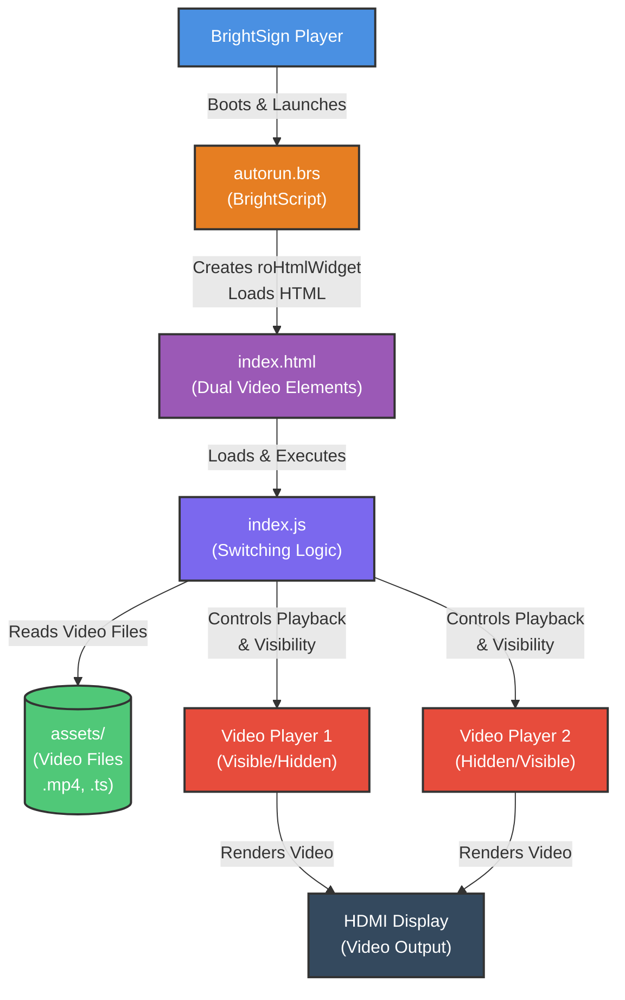

# Architecture Diagram

## Seamless Video Switching Flow

1. **Initial Load**: Player 1 loads and plays the first video
2. **Preload**: While Player 1 plays, Player 2 preloads the next video (hidden)
3. **Switch Trigger**: When Player 1 ends, the switching sequence begins
4. **Start Hidden Player**: Player 2 starts playing (while still hidden)
5. **Wait for Playback**: Wait until Player 2 is actually playing
6. **Instant Transition**: Player 2 becomes visible, Player 1 becomes hidden
7. **Background Preload**: Player 1 (now hidden) preloads the next video
8. **Loop**: Repeat steps 3-7 indefinitely for continuous playback

## Key Features

- **Zero-Gap Transitions**: No black screens or freeze frames between videos
- **Dual Player Technique**: Two HTML5 video elements layered using absolute positioning
- **Background Preloading**: Next video is fully loaded before current video ends
- **Instant Visibility Toggle**: CSS class switching provides immediate visual transition
- **Alphabetical Playback**: Videos are sorted and played in alphabetical order
- **Infinite Loop**: Playlist automatically loops back to the first video

## Legend

- **Blue**: BrightSign Player
- **Orange**: BrightScript
- **Purple**: HTML/JS Application
- **Purple (Dark)**: JavaScript Logic
- **Dark Gray**: External Hardware
- **Green**: Video Files
- **Red**: Video Player Elements
